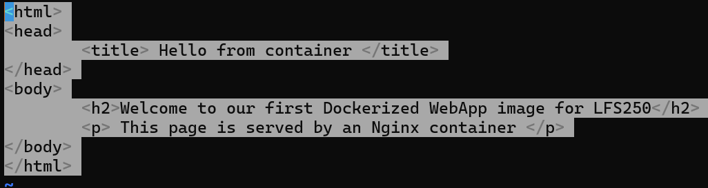

# Building Your Own Docker Image

*A step-by-step guide: writing a Dockerfile, fixing common errors, building the image, and running the container.*

## 1. Write the Dockerfile

A basic Dockerfile for serving a static site with nginx has five key parts: a base image, a working directory, a copy step, an exposed port, and a startup command.

```dockerfile
FROM nginx:latest

WORKDIR /usr/share/nginx/html

COPY index.html .

EXPOSE 80

CMD ["nginx", "-g", "daemon off;"]
```

- **FROM** — the base image to build on top of
- **WORKDIR** — sets the working directory inside the image
- **COPY \<src\> \<dest\>** — copies a file from your build context into the image (always needs two arguments)
- **EXPOSE** — documents which port the container listens on
- **CMD** — the command that runs when the container starts

## 2. Common Errors & Fixes

### Error: `COPY requires at least two arguments`

Caused by a `COPY` instruction missing a destination path, e.g. `COPY index.html` with nothing after it.

```dockerfile
COPY index.html .
```

The `.` tells Docker to copy the file into the current `WORKDIR`.


### Error: image not found / reference not found

Usually a typo in the image tag. Check `docker image ls` for the exact tag name before running a container.


### Container not showing in `docker container ls`

`docker container ls` only shows running containers by default. Use the `-a` flag to see all containers, including stopped ones:

```bash
docker container ls -a
```


### Error: `nginx,: not found`

Check container logs to diagnose why it exited:

```bash
docker logs <container_id>
```

This particular error means the `CMD` instruction had a stray comma inside the command string, so the shell tried to run a program literally named `nginx,`. The fix is to make sure each argument is its own clean, separate string:

```dockerfile
CMD ["nginx", "-g", "daemon off;"]
```


## 3. Build & Run Your Own Image

From the directory containing your Dockerfile and `index.html`:

**Step 1 — Confirm your files are present**

```bash
ls
```

Make sure both `dockerfile` and `index.html` are in this folder (`COPY index.html .` needs it there, unless you set a different build context).

**Step 2 — Build the image**

```bash
docker build -t nginx:lfs250 -f dockerfile .
```

- `-t nginx:lfs250` — tags the image (overwrites an old image with the same tag)
- `-f dockerfile` — points to the Dockerfile by exact filename
- `.` — sets the build context to the current directory

Watch for a final line reading `Successfully tagged nginx:lfs250` with no errors above it.

**Step 3 — Verify the image was rebuilt**

```bash
docker image ls
```

Check that the IMAGE ID for `nginx:lfs250` has changed since the last build.

**Step 4 — Run a container from the new image**

```bash
docker container run -dit -P nginx:lfs250
```

- `-d` — detached (runs in the background)
- `-i -t` — interactive terminal (keeps the process attached)
- `-P` — publish all exposed ports to random host ports

**Step 5 — Confirm it's running**

```bash
docker container ls
```

Status should read `Up X seconds`, not `Exited`.


**Step 6 — Test it**

Note the mapped port under `PORTS` (e.g. `0.0.0.0:32772->80/tcp`), then:

```bash
curl localhost:32772
```

You should see the contents of your `index.html` returned.

Here is what I used for my index.html


## 4. Quick Reference

- `docker build -t <name>:<tag> -f <dockerfile> <context>` — build an image
- `docker image ls` — list local images
- `docker container run -dit -P <image>` — start a container, detached, all ports published
- `docker container ls -a` — list all containers, running or not
- `docker logs <container_id>` — see why a container exited

