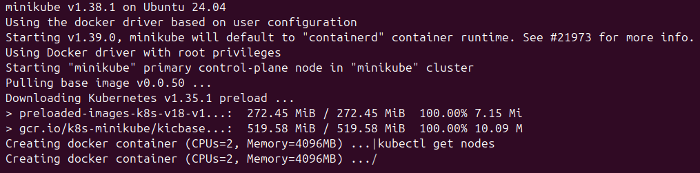
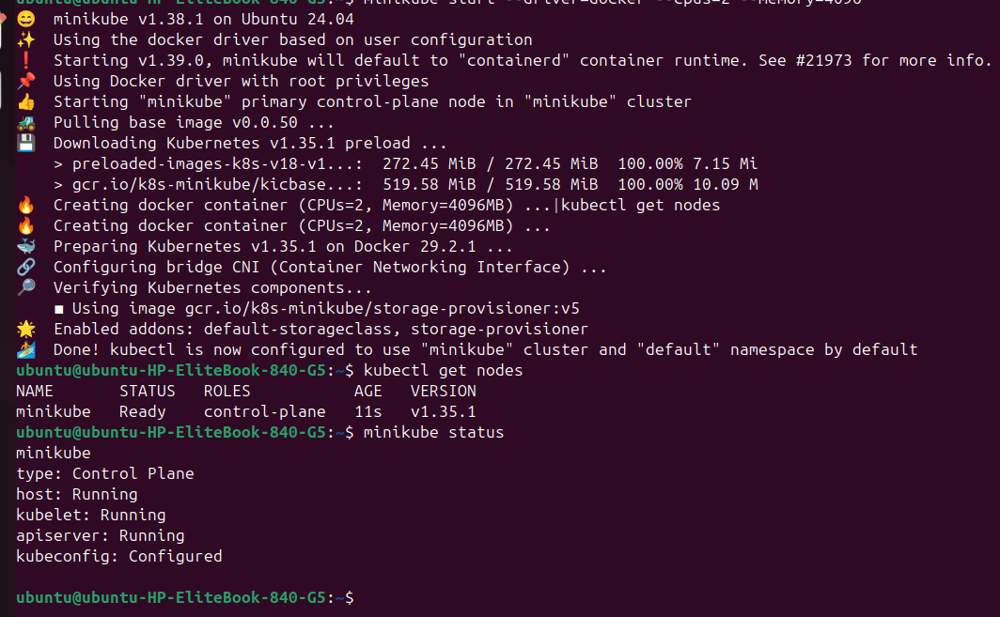
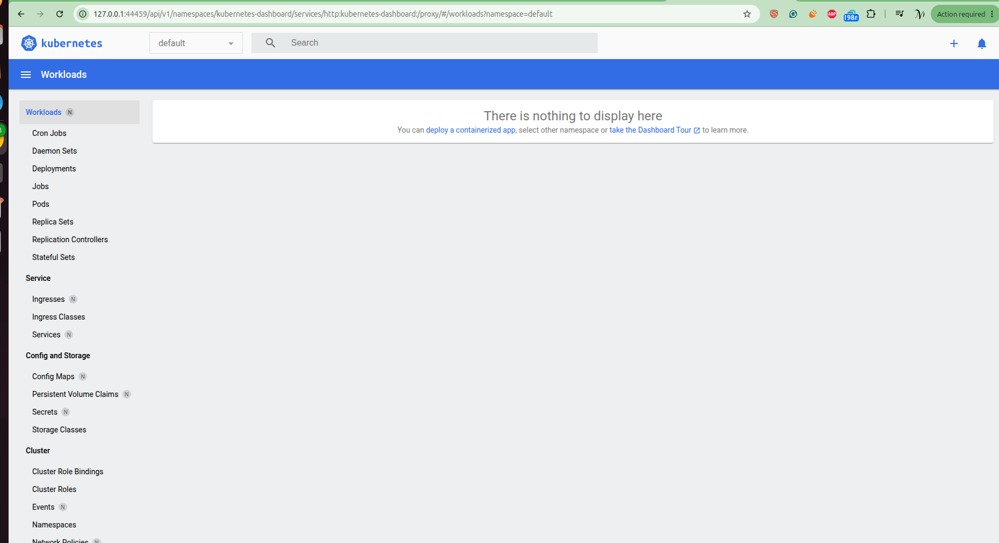
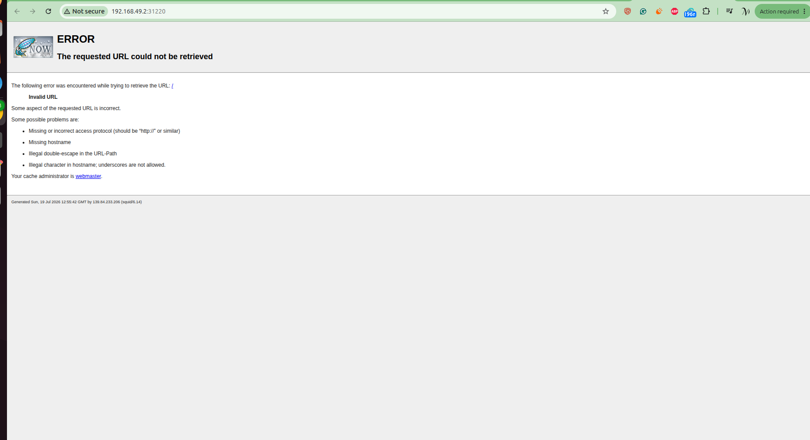
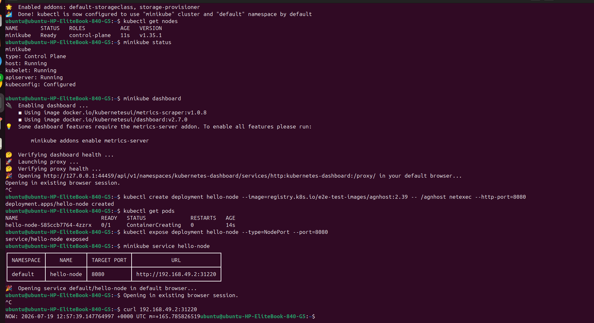

# Setting Up Kubernetes Locally with Minikube on Ubuntu

A step-by-step guide for running Kubernetes on a laptop (16GB RAM / 512GBB storage) for learning purposes, using **minikube** on **Ubuntu 24.04**.

---

## 1. Prerequisites

Minikube needs a driver to run the cluster. Docker is the simplest option for Ubuntu.

```bash
sudo apt update
sudo apt install -y docker.io
sudo usermod -aG docker $USER && newgrp docker
```

## 2. Install kubectl (the Kubernetes CLI)

```bash
curl -LO "https://dl.k8s.io/release/$(curl -L -s https://dl.k8s.io/release/stable.txt)/bin/linux/amd64/kubectl"
sudo install -o root -g root -m 0755 kubectl /usr/local/bin/kubectl
kubectl version --client
```

## 3. Install minikube

```bash
curl -LO https://storage.googleapis.com/minikube/releases/latest/minikube-linux-amd64
sudo install minikube-linux-amd64 /usr/local/bin/minikube
```

## 4. Start the cluster

```bash
minikube start --driver=docker --cpus=2 --memory=4096
```

This pulls the base image and preloaded Kubernetes components, then spins up a single-node cluster inside a Docker container.



*Minikube detects the Docker driver, downloads the Kubernetes v1.35.1 preload images, and begins creating the control-plane container (2 CPUs, 4096MB memory).*

## 5. Verify the cluster is running

```bash
kubectl get nodes
minikube status
```



*Once setup completes: the CNI is configured, addons (`default-storageclass`, `storage-provisioner`) are enabled, and `kubectl get nodes` shows the `minikube` node as `Ready`. `minikube status` confirms host, kubelet, apiserver are all `Running` and kubeconfig is `Configured`.*

## 6. Open the Kubernetes Dashboard (optional)

```bash
minikube dashboard
```



*The dashboard opens in the browser, but shows "There is nothing to display here" — expected, since no deployment has been created yet in the `default` namespace.*

## 7. Deploy a test application

```bash
kubectl create deployment hello-node \
  --image=registry.k8s.io/e2e-test-images/agnhost:2.39 \
  -- /agnhost netexec --http-port=8080
```

Check the pod status:
```bash
kubectl get pods
```

Expose it as a NodePort service:
```bash
kubectl expose deployment hello-node --type=NodePort --port=8080
```

Get the accessible URL:
```bash
minikube service hello-node
```

## 8. Browser access issue (proxy)



*Opening the NodePort URL in the browser can fail with a Squid proxy error ("The requested URL could not be retrieved"). This isn't a Kubernetes problem — it happens when the browser is configured to route traffic through a proxy that can't reach private/local IPs like `192.***.49.2`.*

**Fix options:**
- Add `192.***.49.2` (or `192.***.0.0/16`) to the browser's proxy bypass list, **or**
- Skip the browser entirely and test with `curl` instead (see below).

## 9. Confirm the app works via curl

```bash
curl 192.***.49.2:31220
```



*End-to-end confirmation:*
- `kubectl create deployment hello-node ...` → `deployment.apps/hello-node created`
- `kubectl get pods` → pod `ContainerCreating` then `Running`
- `kubectl expose deployment hello-node --type=NodePort --port=8080` → `service/hello-node exposed`
- `minikube service hello-node` → prints the service URL (`http://192.***.49.2:31220`)
- `curl 192.***.49.2:31220` → returns a live response from the pod:
  ```
  NOW: 2026-07-19 12:57:39.147764997 +0000 UTC m=+165.785826519
  ```

This proves the full pipeline works: **Deployment → Pod → Service → NodePort → reachable app.**

---

## Summary

| Step | Command | Result |
|---|---|---|
| Install driver | `sudo apt install docker.io` | Docker ready |
| Install CLI | `curl ... kubectl` | `kubectl` available |
| Install minikube | `curl ... minikube` | `minikube` available |
| Start cluster | `minikube start --driver=docker --cpus=2 --memory=4096` | Single-node cluster running |
| Verify | `kubectl get nodes` / `minikube status` | Node `Ready`, all components `Running` |
| Deploy app | `kubectl create deployment ...` | Pod running |
| Expose app | `kubectl expose deployment ... --type=NodePort` | Service created |
| Access app | `curl <NodeIP>:<NodePort>` | App responds |

## Next steps to explore
- Scale the deployment: `kubectl scale deployment hello-node --replicas=3`
- Kill a pod and watch Kubernetes self-heal: `kubectl delete pod <pod-name>`
- Write a YAML manifest instead of using `kubectl create` imperatively
- Learn core concepts: Pods vs Deployments vs Services vs ReplicaSets