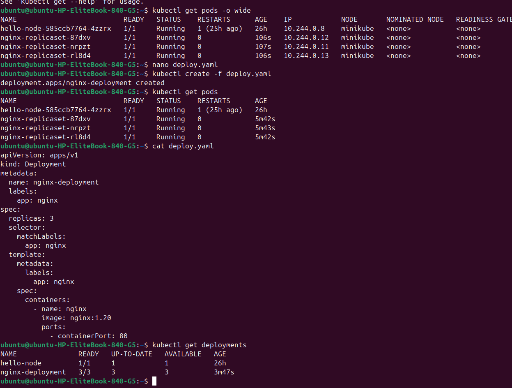
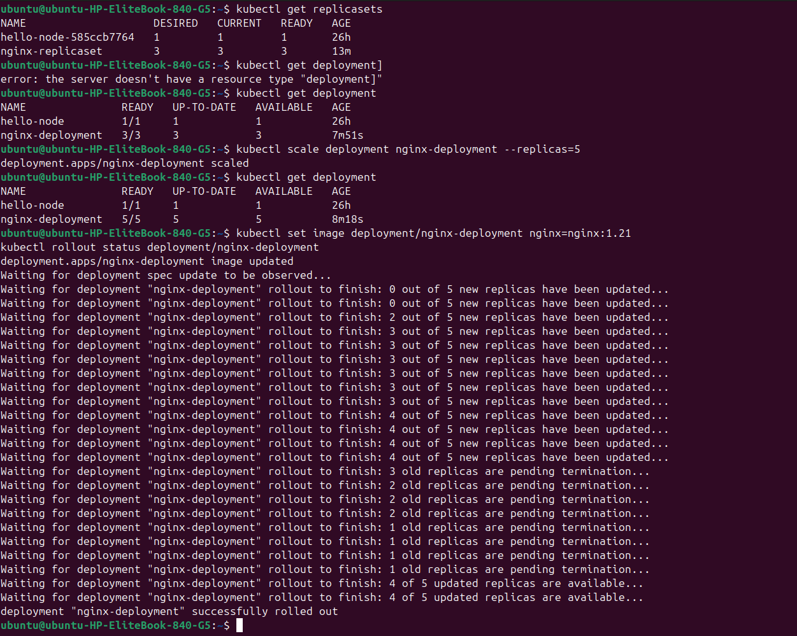
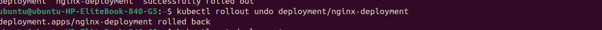

# Kubernetes ReplicaSets & Deployments — Hands-On Guide

A practical walkthrough of creating a ReplicaSet and a Deployment, scaling, performing a rolling update, and rolling back — run on a local minikube cluster.

---

## 1. ReplicaSet manifest

```yaml
apiVersion: apps/v1
kind: ReplicaSet
metadata:
  name: nginx-replicaset
  labels:
    app: nginx
spec:
  replicas: 3
  selector:
    matchLabels:
      app: nginx
  template:
    metadata:
      labels:
        app: nginx
    spec:
      containers:
        - name: nginx
          image: nginx:1.20
          ports:
            - containerPort: 80
```

```bash
kubectl create -f replicaset.yaml
kubectl get pods
```

## 2. Deployment manifest

```yaml
apiVersion: apps/v1
kind: Deployment
metadata:
  name: nginx-deployment
  labels:
    app: nginx
spec:
  replicas: 3
  selector:
    matchLabels:
      app: nginx
  template:
    metadata:
      labels:
        app: nginx
    spec:
      containers:
        - name: nginx
          image: nginx:1.20
          ports:
            - containerPort: 80
```

```bash
kubectl create -f deploy.yaml
```



*After creating the deployment, `kubectl get pods` shows 3 new `nginx-deployment-*` pods running alongside the earlier `nginx-replicaset-*` pods and `hello-node`. `cat deploy.yaml` confirms the manifest structure: `metadata`, `spec.replicas`, `selector.matchLabels`, and the pod `template`. `kubectl get deployments` shows `nginx-deployment` at `3/3` ready.*

## 3. Scaling the Deployment

```bash
kubectl scale deployment nginx-deployment --replicas=5
```

## 4. Rolling update (image change)

```bash
kubectl set image deployment/nginx-deployment nginx=nginx:1.21
kubectl rollout status deployment/nginx-deployment
```



*`kubectl get replicasets` shows the ReplicaSets created for each app. After scaling, `nginx-deployment` goes from `3/3` to `5/5`. The `kubectl set image` command triggers a rolling update — `kubectl rollout status` streams progress as new replicas (running `nginx:1.21`) come up one at a time while old replicas (`nginx:1.20`) are terminated, ending in "deployment "nginx-deployment" successfully rolled out".*

## 5. Rolling back

```bash
kubectl rollout undo deployment/nginx-deployment
```



*`kubectl rollout undo` reverts the deployment to its previous revision (back to `nginx:1.20`), confirmed by `deployment.apps/nginx-deployment rolled back`.*

---

## Summary of commands used

| Action | Command |
|---|---|
| Create ReplicaSet | `kubectl create -f replicaset.yaml` |
| Create Deployment | `kubectl create -f deploy.yaml` |
| List pods | `kubectl get pods` |
| List deployments | `kubectl get deployment` |
| List replicasets | `kubectl get replicasets` |
| Scale deployment | `kubectl scale deployment nginx-deployment --replicas=5` |
| Rolling update | `kubectl set image deployment/nginx-deployment nginx=nginx:1.21` |
| Watch rollout | `kubectl rollout status deployment/nginx-deployment` |
| Roll back | `kubectl rollout undo deployment/nginx-deployment` |

## Key takeaway
A **Deployment** manages a **ReplicaSet**, which manages **Pods**. You rarely create ReplicaSets directly in practice — Deployments give you rolling updates and rollback for free on top of the same replica-management behavior.