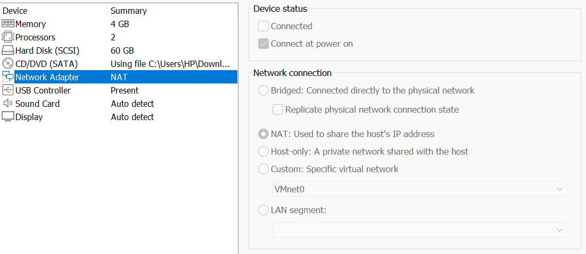
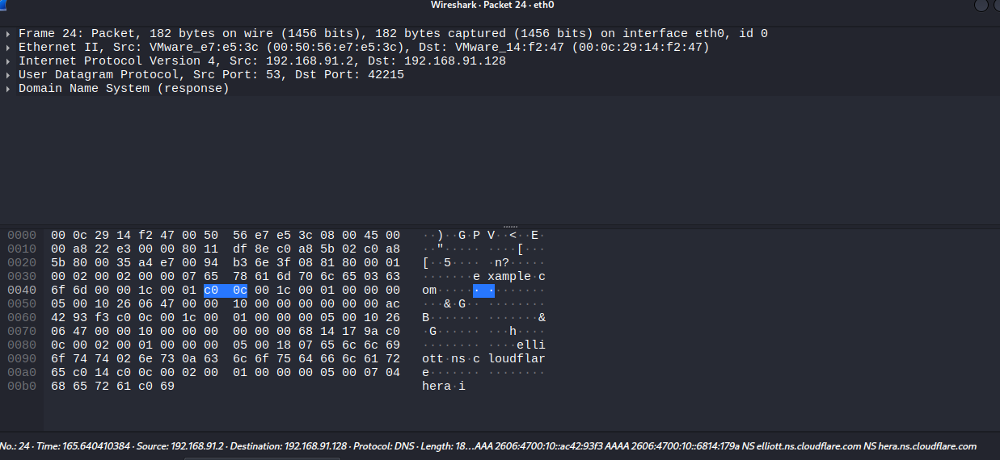
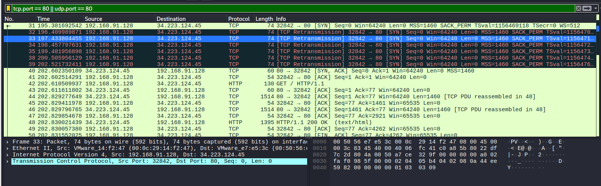
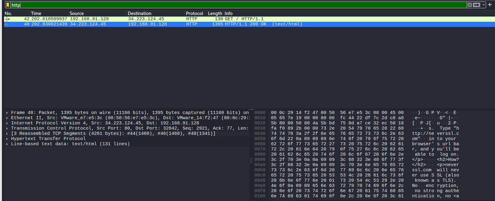
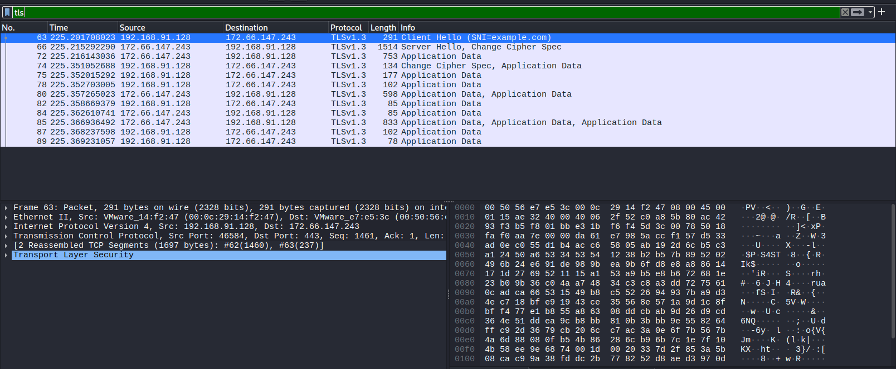

# Week 2 — Capturing & Analyzing Network Traffic with Wireshark

> **Project:** Cybersecurity Portfolio · Week 2
> **Author:** Mercy Lena
> **Date:** [2026/30/06]
> **Lab:** Kali Linux VM (VMware, NAT) → host → internet
> **Goal:** Capture live traffic and identify how DNS, TCP, HTTP, and TLS appear
> on the wire — and what an observer can and can't see in each.

---

## 1. Objective

Capture a single browsing session and use it to demonstrate the layered nature of
a web request: name resolution (DNS), connection setup (TCP), and the application
payload — comparing **unencrypted HTTP** against **encrypted TLS**. The headline
finding: with HTTP, anyone on the path reads the full content; with TLS they learn
only *which* site was visited, not *what* was exchanged.

This document doubles as a repeatable implementation guide so the capture can be
reproduced from scratch.

---

## 2. Prerequisites & Dependencies

| Component | Used here | Notes |
|---|---|---|
| Hypervisor | VMware Workstation/Player | Any will do (VirtualBox works too) |
| Guest OS | Kali Linux | Wireshark and tcpdump are preinstalled |
| Network mode | **NAT** | Gives the VM internet so DNS/HTTP/TLS resolve |
| Wireshark | GUI analyzer | Needs `libxcb-cursor0` on recent Kali (see §4) |
| tcpdump | CLI capture | Zero display dependencies — reliable fallback |
| tshark | CLI analyzer | Wireshark's terminal twin |
| curl | traffic generator | Preinstalled |
| dnsutils | `nslookup` / `dig` | Usually preinstalled |

Install anything missing:

```bash
sudo apt update
sudo apt install -y wireshark tcpdump dnsutils curl libxcb-cursor0
```

> The network adapter must be set to **NAT** in the VM's settings (Network Adapter →
> NAT). This is correct *for this capture* because it provides internet access. When
> you later add deliberately vulnerable victim machines, move those to **host-only**
> so they can't reach the internet.


*Figure 1 — VMware network adapter in NAT mode. "Connected" is unchecked only because
the VM was powered off; "Connect at power on" brings the link up at boot.*

---

## 3. Architecture / Flow

### 3.1 Lab topology

```
[ Kali VM ]  --NAT-->  [ VMware NAT gateway / DNS ]  -->  [ Host NIC ]  -->  Internet
 192.168.91.128            192.168.91.2
```

The VMware NAT service does double duty: it forwards the VM's traffic to the internet
and acts as the VM's DNS resolver (`192.168.91.2`).

### 3.2 What one web request actually does

A single `curl https://example.com` triggers four distinct phases on the wire, each
isolated by its own Wireshark display filter:

1. **DNS lookup** (`dns`) — resolve the hostname to an IP. Runs over **UDP/53**, so
   there is no handshake in front of it.
2. **TCP handshake** (`tcp.flags.syn==1`) — `SYN → SYN-ACK → ACK` opens the connection.
3. **Application payload** — either:
   - **HTTP** (`http`) — plaintext; fully readable by anyone on the path, or
   - **TLS** (`tls.handshake`) — encrypted; only the destination name (SNI) is visible.

Phases 1–2 are identical for HTTP and HTTPS. Only the payload differs — and that
difference is the entire lesson of this exercise.

---

## 4. Method & Code Examples

### 4.1 Generate the traffic

Start the capture first (§5), then run these in a terminal *inside the VM*. Each
produces one clean example:

```bash
nslookup example.com          # DNS query + response
curl http://neverssl.com      # plaintext HTTP (neverssl.com is HTTP-only by design)
curl https://example.com      # TLS handshake, then encrypted application data
```

`neverssl.com` exists specifically to serve plain HTTP — almost every other site
forces HTTPS, so it's the reliable way to capture a readable HTTP example.

### 4.2 Capture — GUI

```bash
wireshark        # NOTE: no sudo if you are already root (sudo strips $DISPLAY)
```

Then pick interface `eth0`, generate traffic, and stop with the red square.

### 4.3 Capture — CLI fallback (no display dependencies)

If the GUI won't launch, capture headless and open the file later:

```bash
tcpdump -i eth0 -w week02.pcap        # Ctrl+C to stop after generating traffic
tshark  -r week02.pcap -Y dns         # inspect just DNS, no GUI needed
wireshark week02.pcap                 # or open it in the GUI once that's working
```

### 4.4 Environment fixes encountered (documented for reproducibility)

On a fresh Kali, launching Wireshark surfaced two issues — both fixed:

```bash
# 1. Qt needs this library on recent Kali:
sudo apt install -y libxcb-cursor0

# 2. Running as root in a desktop owned by another user dropped the X auth.
#    Point root at the desktop user's display + cookie:
export DISPLAY=:0
export XAUTHORITY=/home/<user>/.Xauthority
wireshark
```


*Figure 2 — The "Authorization required" and "could not connect to display" errors,
caused by an empty `$DISPLAY` and missing X authority cookie under a root shell.*

---

## 5. Using Wireshark

### 5.1 Capture filters vs display filters

- A **capture filter** limits what is *recorded* (set before you start). Use sparingly.
- A **display filter** (the green bar) only changes what is *shown* — the full capture
  is still there. Capture everything, then filter the display. It's far more forgiving.

### 5.2 The three panes

- **Packet list** (top) — one row per packet: time, source, destination, protocol, info.
- **Packet detail** (middle) — the same packet expanded layer by layer (Ethernet → IP →
  TCP/UDP → application). This is where you read field values.
- **Packet bytes** (bottom) — the raw hex and its ASCII rendering. For plaintext
  protocols you can literally read the payload here.

### 5.3 The filters used in this analysis

| Filter | Isolates |
|---|---|
| `dns` | DNS queries and responses |
| `tcp.flags.syn==1` | The TCP three-way handshake |
| `http` | Plaintext HTTP requests/responses (try `http.request` if empty) |
| `tls.handshake` | TLS setup; `tls.handshake.type==1` for just the Client Hello |

### 5.4 Follow Stream

Right-click an HTTP packet → **Follow → HTTP Stream** to reassemble the entire
request and response into one readable, color-coded window. This is the single most
useful view for application-layer analysis — and the cleanest screenshot for a report.

---

## 6. Findings & Analysis

### 6.1 DNS — name resolution over UDP


*Figure 3 — DNS response (packet 24) from the NAT resolver `192.168.91.2` over UDP/53.*

The VM queried `example.com` and the resolver returned IPv6 (`AAAA`) records plus the
authoritative name servers `elliott.ns.cloudflare.com` and `hera.ns.cloudflare.com` —
all readable in the byte pane. Because DNS uses **UDP**, the lookup is a simple
query/response with no handshake preceding it.

### 6.2 TCP — connection setup (with a real-world twist)


*Figure 4 — TCP three-way handshake, preceded by several retransmitted SYNs.*

Filtering on port 80 surfaced something more interesting than a textbook handshake:
the VM sent its initial `SYN` and, receiving no answer, fired **six `[TCP Retransmission]`
SYNs** before the server finally replied `SYN, ACK` (packet 40); the VM's `ACK`
(packet 41) then completed the connection. This is TCP's reliability mechanism working
exactly as designed — it keeps retrying an unanswered SYN rather than failing
immediately. (See §7 — this same pattern is a classic troubleshooting signal.)

### 6.3 HTTP — fully exposed plaintext


*Figure 5 — `GET / HTTP/1.1` (packet 42) and the server's `HTTP/1.1 200 OK` (packet 48).
The response HTML is readable in the byte pane.*

Following the HTTP stream produced the complete conversation in cleartext (saved as
`evidence/http-stream.txt`). Concrete, observable details an eavesdropper would learn:

- **Request line & client:** `GET / HTTP/1.1`, `Host: neverssl.com`, `User-Agent: curl/8.20.0`
- **Server software:** `Server: Apache/2.4.66`
- **Payload size & type:** `Content-Length: 3961`, `Content-Type: text/html`
- **The entire HTML body**, verbatim — including, fittingly, the page's own text
  explaining that it uses "no encryption."

The response also spanned three TCP segments that Wireshark reassembled
(`[3 Reassembled TCP Segments]`), a useful reminder that HTTP rides on top of TCP,
which fragments large payloads into multiple packets.

### 6.4 TLS — encrypted, with one thing left visible


*Figure 6 — TLS 1.3 `Client Hello` advertising `SNI=example.com`, followed by opaque
`Application Data`.*

The `Client Hello` (packet 63) shows `SNI=example.com` — the **Server Name Indication
is sent in the clear** so the server knows which certificate to present. After the
`Server Hello` and `Change Cipher Spec`, every subsequent packet is `Application Data`
whose byte pane is indistinguishable from random noise. An observer learns the
destination domain and nothing else.

### 6.5 Exposed vs protected — the core result

| What an on-path observer sees | HTTP (port 80) | TLS (port 443) |
|---|---|---|
| Destination IP | ✅ | ✅ |
| Destination hostname | ✅ (Host header) | ✅ (SNI, cleartext) |
| URL path / query | ✅ | ❌ |
| Request & response headers | ✅ | ❌ |
| Page content / payload | ✅ (fully readable) | ❌ (encrypted) |

This table *is* the argument for HTTPS, demonstrated from a live capture rather than
asserted.

---

## 7. Using Packet Analysis for Troubleshooting

Packet capture is a primary diagnostic tool in both network and security work — when
logs say "it doesn't work," the capture says *why*. The same filters used above map
directly onto common failure modes:

| Symptom | Filter to start with | What you're looking for |
|---|---|---|
| Page/app won't load | `tcp.flags.syn==1` | SYN with no SYN-ACK = blocked/firewalled; repeated retransmits = slow or unreachable; `RST` = actively refused |
| "Site can't be found" | `dns` | No response, `NXDOMAIN`, or a wrong/unexpected answer (possible misconfig or hijack) |
| HTTPS errors / cert warnings | `tls.handshake` or `tls.alert` | Missing Server Hello, failed certificate exchange, or a TLS alert code |
| Slow / laggy connection | `tcp.analysis.retransmission`, `tcp.analysis.duplicate_ack` | Packet loss and retransmits inflating latency |
| Connection drops mid-session | `tcp.flags.reset==1` | Who sent the `RST` and when |

**A worked example from this very capture (§6.2):** the six retransmitted SYNs before
the handshake completed are exactly what a "the site took ages to load the first time"
complaint looks like on the wire. The diagnosis writes itself — the client's initial
SYNs went unanswered, TCP retried on a backoff, and the connection eventually
succeeded once a SYN got through. No application change would have fixed that; the
issue was below the application layer entirely. Being able to *show* that is the
difference between guessing and knowing.

Two reusable habits this exercise builds:
- **Establish a baseline.** Knowing what *normal* DNS/TCP/TLS looks like (this writeup)
  is what lets you spot the abnormal later.
- **Work bottom-up.** Confirm DNS resolved, then that TCP connected, then look at the
  application layer. Most "app" problems are actually resolution or connectivity
  problems one layer down.

---

## 8. Evidence & Artifacts

```
weeks/week-02/
├── writeup.md                  ← this document
├── week02.pcap                 ← the raw capture 
├── evidence/
│   └── http-stream.txt         ← decoded Follow-HTTP-Stream output
└── screenshots/
    ├── 01-nat-adapter.png
    ├── 03-xauthority-fix.png
    ├── 04-http-capture.png
    ├── 05-dns-response.png
    ├── 06-tcp-handshake.png
    └── 07-tls-handshake.png
```


---

## 9. Key Takeaways

- A single web request is four layered operations (DNS → TCP → payload), each visible
  and filterable in Wireshark.
- HTTP exposes everything; TLS protects the payload but still leaks the destination
  hostname via SNI.
- TCP's retransmission behavior, captured live, is a textbook troubleshooting signal —
  the same skill used for analysis is used for diagnosis.
- Capture filters limit recording; display filters limit the view — capture broad,
  filter narrow.

---

## Appendix — screenshot file mapping

Rename your uploaded images to these filenames and drop them in `screenshots/`:

| Uploaded file | Rename to | Shows |
|---|---|---|
| `1782814964012_image.png` | `01-nat-adapter.png` | VM network adapter = NAT |
| `1782817998440_image.png` | `04-http-capture.png` | HTTP GET + 200 OK, readable body |
| `1782818325900_image.png` | `05-dns-response.png` | DNS response over UDP/53 |
| `1782818448867_image.png` | `06-tcp-handshake.png` | Retransmitted SYNs + handshake |
| `1782818503738_image.png` | `07-tls-handshake.png` | TLS Client Hello (SNI) + App Data |
