# Cybersecurity Lab — Commands & Troubleshooting Cheat Sheet

> A personal reference built from real lab work: VMware networking, Wireshark packet
> analysis, Ubuntu Server, Wazuh (SIEM) install, and Windows/Linux boot & password
> recovery. Every command here was run and verified during the lab.
>
> Screenshots are in `./screenshots/`. Keep this folder together so the images render.

**Contents**
1. [VMware VM networking](#1-vmware-vm-networking)
2. [Wireshark — launch troubleshooting](#2-wireshark--launch-troubleshooting)
3. [Wireshark — packet analysis (DNS / TCP / HTTP / TLS)](#3-wireshark--packet-analysis)
4. [Ubuntu Server install notes](#4-ubuntu-server-install-notes)
5. [Wazuh SIEM — install & fixes](#5-wazuh-siem--install--fixes)
6. [Linux — reset a forgotten password](#6-linux--reset-a-forgotten-password)
7. [Windows — boot recovery (0xc0000001)](#7-windows--boot-recovery-0xc0000001)
8. [Hardware diagnostics (HP)](#8-hardware-diagnostics-hp)
9. [Quick command index](#9-quick-command-index)

---

## 1. VMware VM networking

Set the adapter in **VM → Settings → Network Adapter**.

| Mode | Behaviour | Use for |
|---|---|---|
| **NAT** | VM shares host's IP; has internet; isolated from LAN | Installs, updates, capturing real DNS/HTTP/TLS |
| **Host-only** | VM talks only to host + other VMs; **no internet** | Deliberately vulnerable / malware VMs |
| **Bridged** | VM appears as its own device on the physical LAN | Rarely in a lab — exposes the VM |

Rule of thumb: **NAT** while building and capturing; **host-only** for anything intentionally vulnerable.

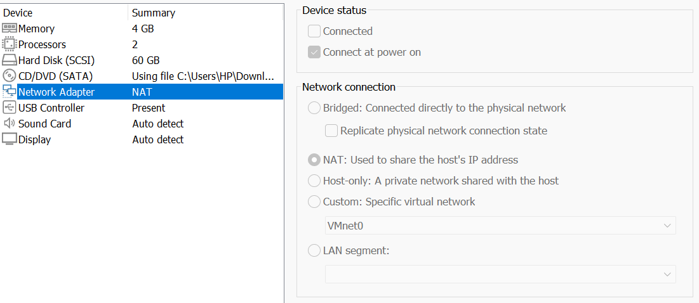

Inside the VM, confirm networking:
```bash
ip addr                 # show interface + IP (e.g. 192.168.x.x)
ping -c 2 8.8.8.8       # confirm internet reachability
```

---

## 2. Wireshark — launch troubleshooting

Two errors hit on a fresh Kali when launching the GUI.

**Error A — missing Qt library** (`xcb-cursor0 or libxcb-cursor0 is needed`):
```bash
sudo apt update && sudo apt install -y libxcb-cursor0
```

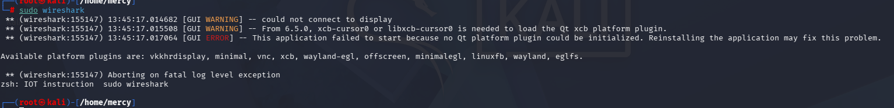

**Error B — "could not connect to display" / "Authorization required"** (running as root in a desktop owned by another user):
```bash
echo $DISPLAY                               # often empty under su
export DISPLAY=:0
export XAUTHORITY=/home/<user>/.Xauthority  # point root at the user's X cookie
wireshark                                   # NOTE: no sudo if already root
```

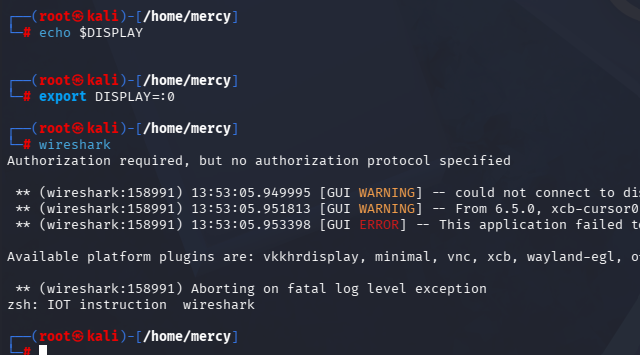

**CLI fallback (no GUI needed):**
```bash
tcpdump -i eth0 -w capture.pcap     # Ctrl+C to stop
tshark  -r capture.pcap -Y dns      # read/filter without the GUI
```

---

## 3. Wireshark — packet analysis

### Display filters (green bar)
```
dns        http       tls        tcp        udp        icmp
http.request                       # requests only
tls.handshake.type == 1            # Client Hello (shows SNI)
tcp.flags.syn == 1                 # handshake SYNs
tcp.port == 80 || udp.port == 80   # all port-80 traffic
tcp.analysis.retransmission        # loss / slow path
```
Right-click a packet → **Follow → HTTP/TCP/TLS Stream** to read a whole exchange.

> **Capture filter vs display filter:** capture filters (BPF, e.g. `tcp port 443`) limit
> what's *recorded* and are set before capture; display filters (e.g. `tcp.port == 443`)
> only change what's *shown*. Capture broad, filter the display — far more forgiving.

### What each protocol looks like

**HTTP (plaintext — fully readable):** `GET /download.html`, then `200 OK`. The page body is visible in the byte pane — anyone on the path sees everything.

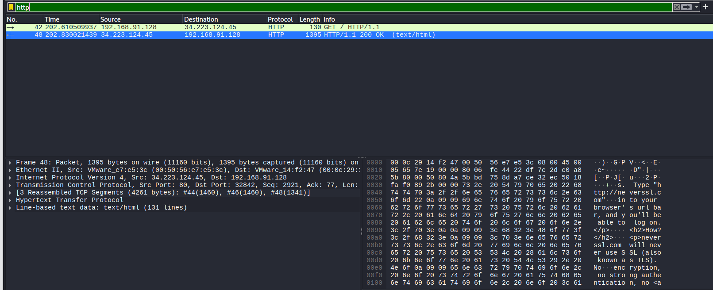

**DNS (UDP/53, no handshake):** a query for a name, and the response carrying the resolved address / name servers.

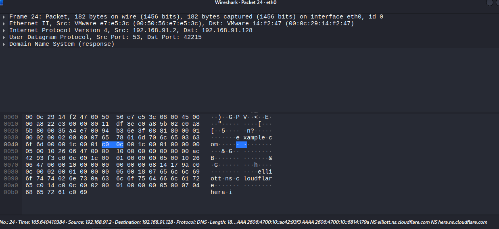

**TCP three-way handshake:** `SYN` → `SYN, ACK` → `ACK`. Repeated `[TCP Retransmission]` SYNs = the first SYNs went unanswered (slow/unreachable path) — TCP retrying is reliability in action.

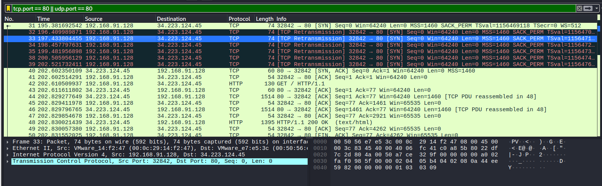

**TLS (encrypted):** `Client Hello (SNI=example.com)` → `Server Hello, Change Cipher Spec` → `Application Data`. Only the **destination name (SNI)** is visible; the payload is encrypted noise. This contrast with HTTP is the whole case for HTTPS.

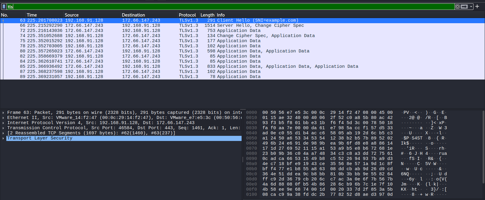

---

## 4. Ubuntu Server install notes

- Choose the **`live-server`** ISO, not Desktop — no GUI saves ~1 GB RAM.
- On the install-type screen pick **Ubuntu Server** (not "minimized").
- Network: DHCP over NAT auto-assigns an IP — **note it**, it's your dashboard address.
- Storage: **Use entire disk + LVM**, leave **LUKS encryption off** for a lab. ⚠️ See §5.1 — guided LVM under-allocates the disk.
- **Tick "Install OpenSSH server"** (press Space) for remote access from the host.
- Skip all featured snaps and Ubuntu Pro ("Skip for now").
- A `Failed unmounting /cdrom` at the end is harmless — press Enter / power-cycle.

VM sizing on a 16 GB host: keep total RAM across all VMs ≈ **half the host** (≈8 GB), e.g. Kali 4 GB + Wazuh 4 GB. Run heavy installs with only one VM powered on.

---

## 5. Wazuh SIEM — install & fixes

### Install (all-in-one)
```bash
curl -sO https://packages.wazuh.com/4.14/wazuh-install.sh
sudo bash ./wazuh-install.sh -a
```
Common gotcha: `No such file or directory` means the download and run were in
different folders — `ls wazuh-install.sh` first, run both from the same directory.

Reach the dashboard from the **host** browser: `https://<vm-ip>` (self-signed cert → "not secure" is expected in a lab).

### 5.1 Dashboard install fails — *disk full*, not memory

The install did indexer + manager + Filebeat, then failed on the **dashboard** and rolled everything back.

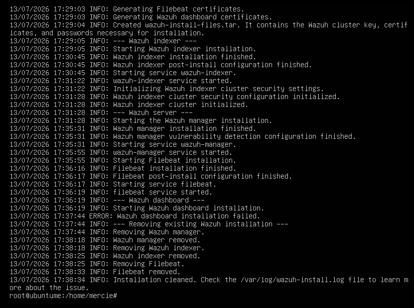

Don't assume memory — **check**:
```bash
free -h        # showed 2.6 GB free → memory was fine
df -h /         # root only 19 GB, ~53% but too small for the unpack
```

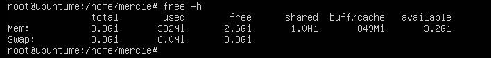

The log named it directly — `dpkg-deb: error: ... disk full`:

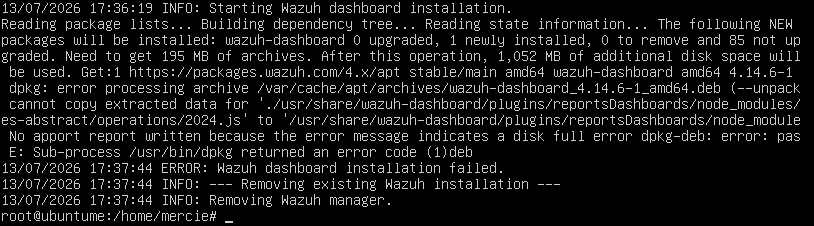
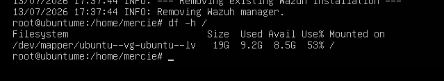

**Root cause:** Ubuntu's guided LVM allocated only ~19 GB of a 40 GB disk to root, leaving the rest unused in the volume group.

**Fix — reclaim the free LVM space:**
```bash
sudo vgs        # confirm VFree (~19 GB free here)
sudo lvextend -l +100%FREE /dev/mapper/ubuntu--vg-ubuntu--lv
sudo resize2fs /dev/mapper/ubuntu--vg-ubuntu--lv
df -h /         # root grows to ~38 GB
```

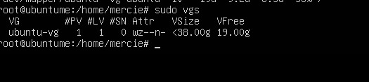

Then clear the partial packages and re-run with **overwrite**:
```bash
sudo apt clean
sudo bash ./wazuh-install.sh -a -o     # -o wipes the rolled-back remnants
```

> A `There was an error accessing the API. Retrying...` line during install is **INFO**,
> not an error — the script is waiting for the manager API to come up. It continues.

### 5.2 Retrieve the admin password
The installer saves credentials in `wazuh-install-files.tar` (note: **passwords**, plural):
```bash
sudo tar -O -xf wazuh-install-files.tar wazuh-install-files/wazuh-passwords.txt
# or jump to the admin block:
sudo tar -O -xf wazuh-install-files.tar wazuh-install-files/wazuh-passwords.txt | grep -i -A1 admin
```
Look for `indexer_username: 'admin'` / `indexer_password: '...'`.

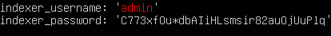

Generated passwords mix look-alike characters (`I` vs `l` vs `1`, `O` vs `0`) — use the dashboard's **eye icon** to verify, or paste rather than type.

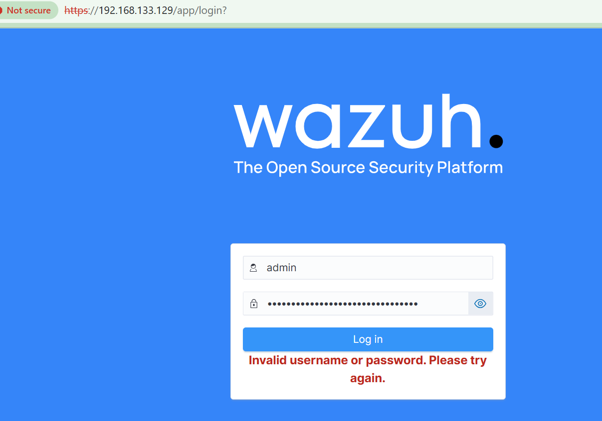

### 5.3 Reset the admin password
```bash
sudo /usr/share/wazuh-indexer/plugins/opensearch-security/tools/wazuh-passwords-tool.sh \
  -u admin -p 'Wazuh1234-'
```
⚠️ Password rules: 8–64 chars, with upper + lower + digit + **a symbol from `. * + ? -` only** (`!` is rejected). Wait ~30–60 s for it to propagate, then log in.

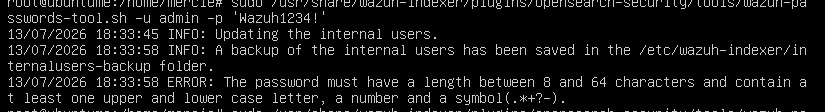

### 5.4 Cap the indexer memory (stability on a small VM)
```bash
sudo nano /etc/wazuh-indexer/jvm.options   # set:
-Xms1g
-Xmx1g
sudo systemctl restart wazuh-indexer
```

---

## 6. Linux — reset a forgotten password

Locked out of an Ubuntu VM (wrong password / keyboard-layout mix-up):

1. Reboot; **hold `Shift`** (or tap `Esc`) at boot to open **GRUB**.
2. **Advanced options for Ubuntu → …(recovery mode)**.
3. Choose **root — Drop to root shell prompt**.

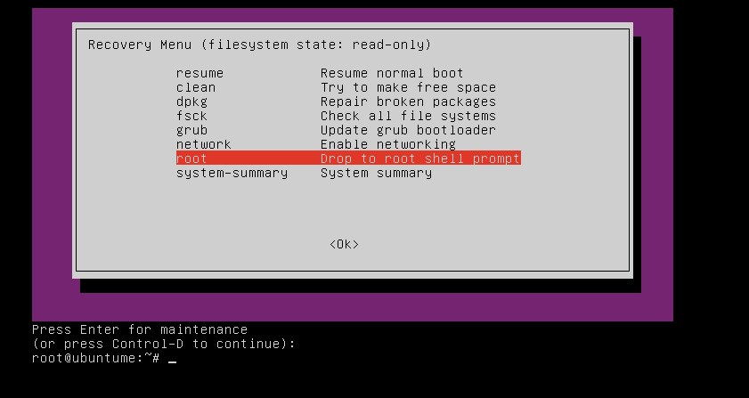

4. Remount read-write and reset:
```bash
mount -o remount,rw /
passwd <username>          # e.g. passwd mercie
# choose a simple temp password (lowercase+digits) to dodge layout issues
```
5. `exit` → **resume** normal boot.

> List real user accounts if unsure of the name:
> `awk -F: '$3>=1000 && $3<65534 {print $1}' /etc/passwd`
> Linux is case-sensitive: `mercie` ≠ `Mercie`.

> **Security note:** this works because console access = full access. Real servers
> mitigate with full-disk encryption (LUKS) and/or a GRUB password.

---

## 7. Windows — boot recovery (0xc0000001)

Reach recovery: from the error screen press **Esc/F1 → Recovery**, or force it by
powering off mid-boot **3 times**, which opens **Choose an option**.

**Try in order** (all non-destructive to files):

1. **Troubleshoot → Advanced options → Startup Repair.**
2. **Safe Mode** (Advanced Boot Options → Safe Mode with Networking) — if it boots, back up files immediately.
3. **Command Prompt** — confirm data is safe, then rebuild boot files the **UEFI-aware** way:
```cmd
C:
dir                         REM confirm Windows\ and Users\ exist = data safe

diskpart
list volume                 REM find the small ~100 MB FAT32 volume = EFI System Partition
select volume <EFI#>
assign letter=S
exit

bcdboot C:\Windows /s S: /f UEFI     REM want: "Boot files successfully created"
```
4. Check the disk:
```cmd
chkdsk C: /f /r             REM N to force-dismount, Y to schedule at restart
```

> Note the flag case: lowercase `/s` (source), capital `S:` (the drive letter), uppercase `UEFI`.
> `bootrec /rebuildbcd` reporting "0 Windows installations" is a known UEFI quirk — `bcdboot` is the command that matters.

**If repairs don't hold after multiple tries** → the cause is almost certainly
**hardware (RAM / controller)**. Stop, back up (drive is readable), and get it serviced.
No command fixes failing memory.

---

## 8. Hardware diagnostics (HP)

Power on → tap **F2** (or **Esc → F2**) for **HP PC Hardware Diagnostics**:

| Test | What it tells you |
|---|---|
| **Storage → Hard Drive/SSD Tests** | Drive detected? SMART PASS/FAIL (drive health) |
| **Memory Test** | RAM errors — the usual cause of repeated random crashes/boot loss |
| **System Board / Component** | Broader component health |

- **SMART: PASSED** = drive physically healthy (data not lost — boot is a separate issue).
- **Note any Failure ID** (24-char code) for the technician.
- Windows' own RAM test: Start → **Windows Memory Diagnostic → Restart now**.

> Golden rule across all of §7–8: **a boot failure is almost never data loss.**
> Confirm files exist (`dir C:`) before anything drastic; never "Reset → Remove
> everything" or reinstall without a backup.

---

## 9. Quick command index

```bash
# --- networking check (any Linux VM) ---
ip addr ; ping -c 2 8.8.8.8

# --- wireshark fixes ---
sudo apt install -y libxcb-cursor0
export DISPLAY=:0 ; export XAUTHORITY=/home/<user>/.Xauthority ; wireshark

# --- cli capture / analyse ---
tcpdump -i eth0 -w cap.pcap
tshark  -r cap.pcap -Y dns

# --- disk space / LVM expand ---
df -h / ; free -h ; sudo vgs
sudo lvextend -l +100%FREE /dev/mapper/ubuntu--vg-ubuntu--lv
sudo resize2fs /dev/mapper/ubuntu--vg-ubuntu--lv

# --- wazuh ---
curl -sO https://packages.wazuh.com/4.14/wazuh-install.sh
sudo bash ./wazuh-install.sh -a            # add -o to overwrite a failed run
sudo tar -O -xf wazuh-install-files.tar wazuh-install-files/wazuh-passwords.txt | grep -i -A1 admin

# --- linux password reset (recovery root shell) ---
mount -o remount,rw / ; passwd <user>

# --- windows uefi boot rebuild (recovery cmd) ---
diskpart > list volume > select volume <EFI#> > assign letter=S > exit
bcdboot C:\Windows /s S: /f UEFI
chkdsk C: /f /r
```

---

*Personal lab reference — built from hands-on troubleshooting. Screenshots in `./screenshots/`.*
